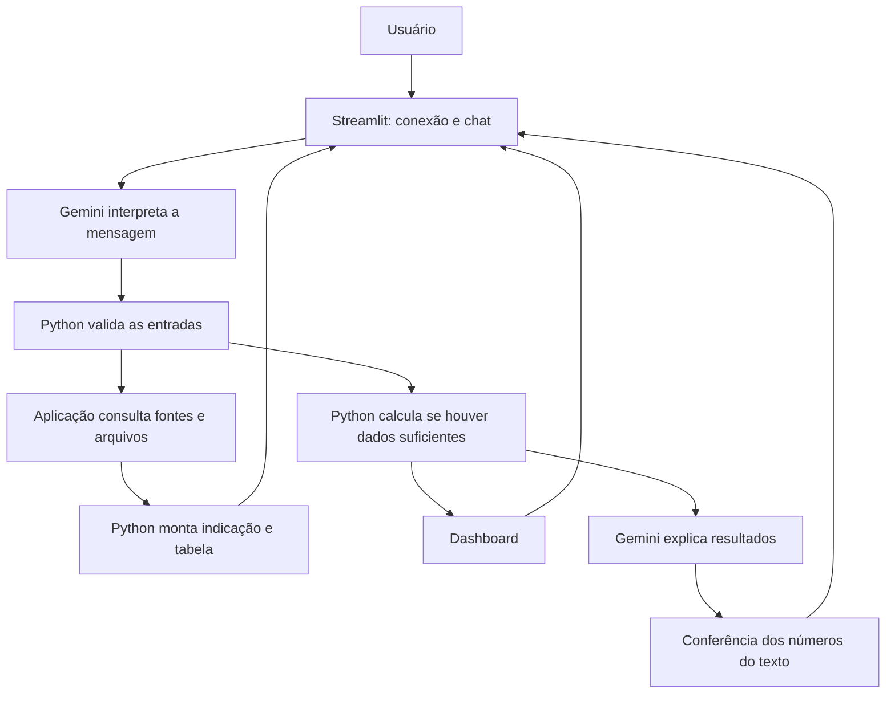

# Documentação do Agente

## Caso de Uso

### Problema

Quem começa a investir precisa entender quanto guardar e quais tipos de investimento combinam com sua meta. Taxas isoladas não explicam carência, risco ou possibilidade de resgate, e podem criar expectativas irreais sobre o rendimento.

### Solução

O Investment Analytics Agent recebe meta, saldo inicial, aporte mensal, prazo e necessidade de resgate. Consulta a base, apresenta uma indicação inicial com tabela curta e calcula em Python a evolução do planejamento para exibir no Streamlit.

O chat calcula aportes e prazo sem rendimento. O motor também mantém suporte a cenários hipotéticos em Python, fora da interface simplificada. Recomenda classes de investimentos conforme as condições informadas; ainda não calcula retornos líquidos de ofertas específicas nem confirma qual produto é o mais rentável.

### Público-Alvo

Pessoas iniciantes que querem planejar uma meta e entender quais classes de renda fixa considerar antes de contratar um investimento.

## Persona e Tom de Voz

### Nome do Agente

Investment Analytics Agent (IAA).

### Personalidade

Direto, respeitoso e realista. Informa limitações concretas, sem inventar taxas ou prometer que rendimentos compensarão aportes insuficientes.

### Tom de Comunicação

Linguagem simples. A resposta começa pela indicação inicial, inclui uma tabela curta e explica os resultados da meta. Fontes e detalhes técnicos ficam sob solicitação no chat.

### Exemplos de Linguagem

- **Início:** “Quanto você quer juntar e em quanto tempo?”
- **Dados faltantes:** “Quanto você já tem guardado e quanto consegue aportar por mês?”
- **Indicação inicial:** “Como você pode precisar resgatar antes, eu começaria avaliando Tesouro Selic. Confira o prazo de crédito do resgate.”
- **Limitação:** “Não confirmei uma taxa para essa opção nesta consulta.”

## Arquitetura

### Diagrama

A aplicação aciona as consultas; não depende de a LLM decidir usar uma ferramenta. As fontes principais são baixadas em paralelo. Cada fonte registra sucesso, falha ou defasagem. A interface exige uma conexão Gemini validada. Os cálculos continuam independentes do modelo e são feitos em Python.

### Componentes

| Componente | Responsabilidade atual |
|---|---|
| Streamlit | Conexão, chat com tabela e dashboard abaixo das respostas |
| Gemini | Classificar a mensagem, interpretar dados explícitos e explicar conceitos e resultados fornecidos |
| Base de conhecimento | Catálogo, regras documentais, fontes públicas, histórico e contexto por meta |
| Planejamento Python | Aportes, diferença para a meta, prazo necessário e hipótese bruta opcional |
| Recomendação Python | Indicação por classe, tabela e filtros de incompatibilidades evidentes |
| Validação | Entradas, unidades, datas, integridade e números autorizados na explicação |

## Segurança e Anti-Alucinação

### Controles implementados

- Chave em memória na sessão e teste de conexão antes de liberar o chat; não é gravada em arquivos da aplicação.
- Cálculos e gráficos derivados do mesmo resultado Python.
- Extração da meta exige trecho literal da mensagem, sem assumir valores ausentes como zero.
- Valores são validados antes de alterar a sessão. Uma nova meta explícita não herda valores do planejamento anterior.
- Números da explicação precisam corresponder aos marcadores fornecidos pelo motor; falhas retornam o resumo determinístico.
- Dados históricos e falhas não são apresentados como consultas atuais bem-sucedidas.
- Fontes e documentos são conteúdo, não instruções para alterar o comportamento do agente.

### Limitações Declaradas

A indicação é inicial, baseada em prazo e liquidez, sem avaliação completa do perfil de risco. As faixas do Open Finance não são ofertas contratáveis e não informam a data individual das taxas. Filtros por intervalos de carência excluem incompatibilidades evidentes, mas não comprovam adequação de uma oferta.

Não há motor de retorno líquido por produto, impostos e custos executáveis ou modelo de venda antecipada. O agente não executa investimentos nem acessa contas bancárias. O comportamento qualitativo do Gemini e a experiência de usuários ainda exigem avaliação real, conforme [04-metricas.md](04-metricas.md).
